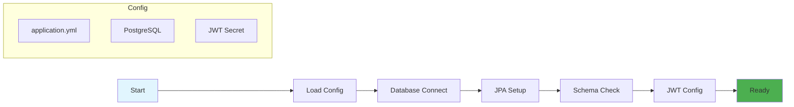

# Database Configuration and Application Execution Flow

## Data Implementation and Program Execution Flowchart

## Configuration Flow Description

### 1. **Application Bootstrap Phase**
- Spring Boot application starts and loads configuration files
- Profile-based configuration selection (dev/prod)
- Externalized configuration management

### 2. **Database Connection Phase**
- PostgreSQL connection establishment
- Connection pool initialization
- Connection validation and error handling

### 3. **JPA/Hibernate Configuration Phase**
- Entity scanning and mapping
- Database schema validation
- Automatic schema updates (ddl-auto: update)
- SQL query logging (show-sql: true)

### 4. **Security Configuration Phase**
- JWT secret key loading
- Token expiration configuration
- Security context initialization

### 5. **Data Layer Initialization Phase**
- Repository bean creation
- Data access layer preparation
- Application readiness verification

## Key Configuration Benefits

### **Externalized Configuration**
- Easy modification without code changes
- Environment-specific settings
- Secure credential management

### **Database Flexibility**
- Profile-based database selection
- Automatic schema management
- Connection pooling optimization

### **Security Management**
- Centralized JWT configuration
- Environment-specific secrets
- Configurable token expiration

### **Development Support**
- SQL query logging for debugging
- Schema auto-update for rapid development
- Comprehensive error handling
