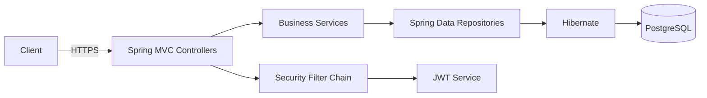
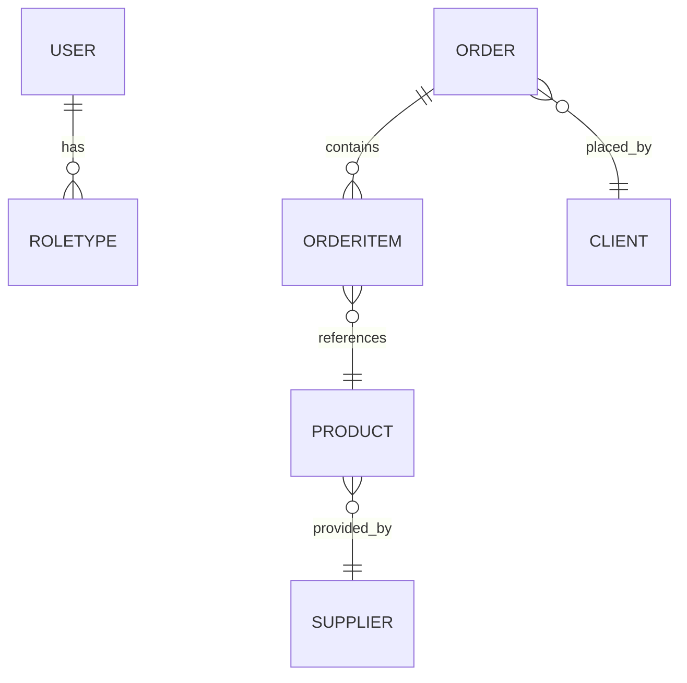
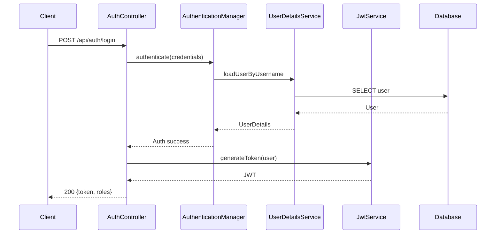
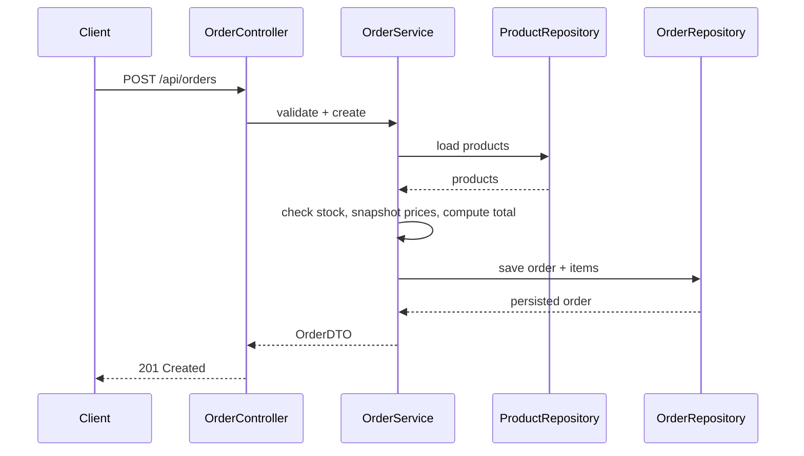
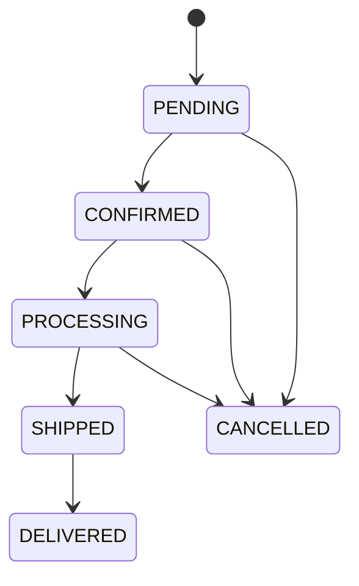

## Steel Backend — Comprehensive Specification, Blueprint, and Operating Manual

### 1. Vision and Scope

- **Product name**: Steel Backend
- **One-liner**: A secure, scalable, and extensible backend platform to digitize and optimize steel utensils import/export and distribution operations.
- **Primary outcomes**:
  - Centralize product, inventory, order, client, and supplier data
  - Enforce business rules consistently and transparently
  - Provide real-time visibility and analytics for data-driven decisions
  - Enable secure, role-based collaboration across teams and locations
- **Out of scope (initial release)**: Payments processing, multi-tenant SaaS, formal EDI integration, complex ERP sync (roadmap items below)

### 2. Stakeholders and Personas

- **Executive Sponsor**: C-level stakeholder seeking operational efficiency and reporting
- **IT Lead / Architect**: Owns deployment, security posture, and SLAs
- **Business Administrator (ADMIN)**: Sets up users, roles, business rules
- **Sales Manager (MANAGER)**: Oversees orders, pricing, client relationships
- **Inventory Manager (MANAGER)**: Oversees stock levels, replenishment, supplier performance
- **Operations Staff (STAFF)**: Executes order fulfillment and daily operations

### 3. Glossary

- **SKU**: Stock-keeping unit; unique identifier for a product variant
- **Order**: A customer purchase intent composed of one or more order items
- **Order Status**: PENDING, CONFIRMED, PROCESSING, SHIPPED, DELIVERED, CANCELLED
- **Reservation**: Temporary deduction of inventory during order processing
- **Reorder Point (ROP)**: Stock threshold that triggers replenishment

### 4. Measurable Objectives and KPIs

- **Order processing time**: Reduce median by 50% within 3 months
- **Inventory accuracy**: ≥ 99% across tracked SKUs
- **Service availability**: ≥ 99.9% monthly uptime
- **Mean API latency (p50/p95)**: p50 < 120 ms, p95 < 300 ms (read-heavy)
- **Defect escape rate**: < 2% post-release defects per sprint

### 5. Non-Functional Requirements (NFRs)

- **Security**: OWASP ASVS-aligned, JWT-based auth, RBAC, secure secrets
- **Compliance-readiness**: Audit logging for critical actions; PII handling guidance
- **Performance**: Handle 100 concurrent active users, 20 orders/min sustained
- **Scalability**: Stateless app tier; horizontal scale to 10x load with predictable cost
- **Reliability**: Zero data loss on single-node failure; RPO ≤ 15 min, RTO ≤ 60 min
- **Observability**: Metrics, logs, traces; alerting on SLO breaches
- **Maintainability**: Modular packages, >80% critical-path test coverage
- **Portability**: Run locally, on-prem, or cloud with minimal changes

### 6. System Architecture

- **Pattern**: Layered architecture (web → service → repository), stateless app tier
- **Core tech**: Spring Boot 3.3.x, Java 17, Spring Security 6, Spring Data JPA, Hibernate, PostgreSQL 15+
- **API**: REST with OpenAPI specs; Swagger UI for interactive docs
- **Authentication**: JWT (HS256), short-lived access tokens; configurable expiry
- **Authorization**: Role-based access (ADMIN, MANAGER, STAFF) via method/endpoint security
- **Configuration**: Externalized via `application.yml` and environment variables
- **Packaging**: Fat JAR; containerization recommended for prod



### 7. Domain Model (Entities, Fields, Constraints)

#### 7.1 User
- `id: UUID` (PK)
- `username: string` (unique, 3-64)
- `passwordHash: string` (BCrypt)
- `enabled: boolean`
- `roles: Set<RoleType>` (ADMIN|MANAGER|STAFF)
- Audit: `createdAt`, `updatedAt`

Constraints:
- Unique `(username)`
- Password policy external to DB (validation layer)

#### 7.2 Product
- `id: UUID` (PK)
- `sku: string` (unique, required)
- `name: string` (required, 1-128)
- `description: text` (nullable)
- `category: string` (indexed)
- `unitPrice: decimal(12,2)` (>= 0)
- `stockQuantity: integer` (>= 0)
- `reorderPoint: integer` (>= 0, default 0)
- `supplier: Supplier` (many-to-one)
- `attributes: jsonb` (optional free-form)
- Audit fields

Indices:
- `(sku)` unique, `(category)`, `(name)`

#### 7.3 Supplier
- `id: UUID`
- `name: string` (unique)
- `contactEmail: string`
- `phone: string`
- `address: string`
- `rating: int` (1-5)
- Audit fields

#### 7.4 Client
- `id: UUID`
- `name: string` (required)
- `email: string`
- `phone: string`
- `billingAddress: string`
- `shippingAddress: string`
- `creditLimit: decimal(12,2)`
- Audit fields

#### 7.5 Order
- `id: UUID`
- `client: Client` (many-to-one, required)
- `status: enum` (PENDING, CONFIRMED, PROCESSING, SHIPPED, DELIVERED, CANCELLED)
- `totalAmount: decimal(14,2)` (computed)
- `currency: string` (ISO 4217, default "USD")
- `notes: text`
- Audit fields

Constraints:
- `totalAmount` equals sum(order items line totals)

#### 7.6 OrderItem
- `id: UUID`
- `order: Order` (many-to-one)
- `product: Product` (many-to-one)
- `quantity: int` (>0)
- `unitPrice: decimal(12,2)` (snapshot from product at time of order)
- `lineTotal: decimal(14,2)` (= quantity * unitPrice)

Relationships summary:
- `Order 1..* OrderItem`, `OrderItem *..1 Product`, `Product *..1 Supplier`, `Order *..1 Client`, `User *..* RoleType`



### 8. Business Rules and Invariants

- Orders cannot move to CONFIRMED without all items having sufficient stock
- On order CONFIRMED → PROCESSING, reserve stock; on CANCELLED, release reservation
- On SHIPPED, decrement `stockQuantity` permanently
- `unitPrice` for an `OrderItem` must be copied from `Product.unitPrice` at creation time (price snapshot)
- `Product.stockQuantity` cannot become negative; operations must be atomic
- `Client.creditLimit` may gate CONFIRMED status when enabled (feature flag)

### 9. API Surface (Detailed)

Base path: `/api`

#### 9.1 Auth
- `POST /auth/login`
  - Request: `{ username, password }`
  - Success: `{ token, expiresAt, roles }`
  - Errors: 401 invalid credentials, 423 account disabled
  - Rate limit: 10/min/IP (enforced at gateway/proxy where available)

#### 9.2 Products
- `GET /products` — list with pagination & filters
  - Query: `page, size, sort, name, category, supplierId, lowStockOnly`
  - Response: `Page<ProductDTO>`
- `GET /products/{id}` — fetch one
- `POST /products` — create (ADMIN|MANAGER)
- `PUT /products/{id}` — update (ADMIN|MANAGER)
- `DELETE /products/{id}` — delete (ADMIN)
- `GET /products/low-stock?threshold=10` — convenience endpoint

Validation examples:
- `sku` required unique; `unitPrice >= 0`; `reorderPoint >= 0`

#### 9.3 Orders
- `GET /orders` — filters: `status, clientId, dateFrom, dateTo`
- `GET /orders/{id}` — details with items
- `POST /orders` — create order with items
  - Request: `{ clientId, currency?, items: [{ productId, quantity }] }`
  - Behavior: validate client, validate stock, snapshot prices, compute totals
- `PUT /orders/{id}/status` — transitions with validation
  - Allowed transitions: PENDING→CONFIRMED→PROCESSING→SHIPPED→DELIVERED; any→CANCELLED
  - Side effects: reserve/release/decrement stock

#### 9.4 Clients & Suppliers
- Standard CRUD with search and pagination
- Client deletion is soft-delete when orders exist; Supplier deletion blocked if products reference

Error model (common):
```json
{
  "timestamp": "2025-01-15T12:34:56Z",
  "status": 400,
  "error": "Bad Request",
  "code": "VALIDATION_ERROR",
  "message": "sku must be unique",
  "details": ["sku: already exists"],
  "path": "/api/products"
}
```

### 10. Security Design

- **AuthN**: JWT with HS256; token lifetime configurable (default 24h)
- **AuthZ**: RBAC via Spring Security; endpoint method security annotations
- **Password policy**: BCrypt with cost factor ≥ 10; enforce min length & complexity
- **Secret management**: `APP_JWT_SECRET` from environment; never hardcode
- **Transport security**: HTTPS-only in production; HSTS at proxy
- **Threat modeling**:
  - Brute force login → rate limits & exponential backoff
  - JWT theft → short TTL, logout token blacklist (optional), IP claim (optional)
  - IDOR → repository-level filters by ownership where applicable (future)
  - SQLi/XSS → parameterized queries, output encoding via framework defaults
  - Data leakage in logs → PII scrubbing middleware/log appender config

### 11. Validation and Error Handling

- Use Bean Validation annotations (JSR 380)
- Centralized `@ControllerAdvice` for exception mapping
- Consistent error codes: `VALIDATION_ERROR`, `AUTH_FAILED`, `NOT_FOUND`, `CONFLICT`, `FORBIDDEN`, `INTERNAL_ERROR`
- Never expose stack traces to clients; correlate with request ID in logs

### 12. Performance and Capacity Planning

- Connection pool: HikariCP tuned for CPU cores and DB max connections
- N+1 detection: enable Hibernate statistics in lower envs; use `@EntityGraph`/fetch joins
- Caching (phase 2): Redis for low-cardinality reference data, token blacklists, settings
- Batch writes for imports (future): use Spring Batch for large data loads

### 13. Observability and Logging

- **Metrics**: JVM, HTTP (p50/p90/p95), DB pool metrics via Micrometer
- **Tracing**: OpenTelemetry instrumentation (future), propagate trace IDs
- **Logging**: JSON logs in production; correlation ID per request; PII scrubbing
- **Dashboards**: API latency, error rate, DB connections, GC pauses
- **Alerts**: Error rate spikes, p95 latency breaches, DB pool exhaustion, disk usage

### 14. Deployment and Environments

- **Environments**: local → dev → staging → production
- **Configuration matrix**:
  - DB URLs, credentials, JWT secret, CORS origins, logging levels
- **Containerization (recommended)**: Distroless base, non-root user, read-only FS where possible
- **Blue/Green or Rolling**: Prefer rolling with readiness probes
- **DB migrations**: Flyway/Liquibase (future) for deterministic schema evolution

### 15. Backup, Restore, and DR

- **Backups**: Daily full + 15-min WAL archiving (PostgreSQL)
- **Restore**: Tested quarterly; document RTO/RPO; separate environment for drills
- **DR**: Cross-AZ (cloud) or offsite replica (on-prem); failover runbook maintained

### 16. Data Lifecycle and Compliance

- **Retention**: Orders and financial data ≥ 7 years (configurable per jurisdiction)
- **PII handling**: Minimize collection; mask in logs; encrypt at rest (DB/disk)
- **Right to erasure**: Soft-delete plus scheduled hard-delete for eligible records (future)

### 17. Testing Strategy

- **Unit tests**: Services, validators, mappers
- **Integration tests**: Controller + repository with Testcontainers PostgreSQL
- **Contract tests**: OpenAPI schema validation for request/response
- **End-to-end (future)**: Synthetic journeys for critical flows
- **Performance tests**: k6/Gatling for baseline and regressions

### 18. Release Management

- **Versioning**: Semantic (MAJOR.MINOR.PATCH)
- **Changelog**: Auto-generated from conventional commits (future)
- **Artifacts**: Built via CI; SBOM generation (future)
- **Rollbacks**: Keep last two artifact versions and DB migration down scripts when possible

### 19. Risk Register

- **Single DB instance becomes bottleneck** → Read replicas, partitioning roadmap
- **JWT secret leakage** → Rotate secrets, invalidate tokens, incident runbook
- **Schema drift** → Adopt migration tooling and gating checks in CI
- **N+1 query regressions** → Static analysis and integration tests with assertion
- **Human errors in ops** → Idempotent scripts, guard rails, least-privilege IAM

### 20. Roadmap (Epics and Milestones)

- **M1 Core GA**: CRUD modules, auth, RBAC, basic reporting, Swagger
- **M2 Reliability**: Observability, backups, performance tuning, CI hardening
- **M3 Integrations**: ERP connector skeleton, CSV import/export, email notifications
- **M4 Scale**: Caching, search indices, async processing for heavy tasks
- **M5 Enterprise**: Multi-tenant, SSO/SAML, fine-grained permissions, audit dashboards

### 21. Configuration and Secrets

Example `application.yml` baseline:
```yaml
spring:
  datasource:
    url: jdbc:postgresql://localhost:5432/steel_db
    username: steel_user
    password: ${DB_PASSWORD}
  jpa:
    hibernate:
      ddl-auto: update
    show-sql: false

app:
  jwt:
    secret: ${APP_JWT_SECRET}
    expiration-ms: 86400000
  cors:
    allowed-origins: ["http://localhost:3000"]
```

### 22. Sequence Diagrams (Key Flows)

#### 22.1 Authentication


#### 22.2 Order Creation


### 23. State Machines

Order status transitions:


### 24. Data Import/Export (Phase 2)

- **CSV Import**: Products and clients; validate schema; dry-run mode; idempotent
- **CSV Export**: Orders and inventory snapshots with time stamps
- **Bulk APIs**: Bounded batch size, back-pressure via 429 on overload

### 25. Runbooks (Operations)

#### 25.1 Rotate JWT Secret
1. Generate new secret; store in secret manager
2. Deploy app with dual-secret validation (current + next) feature flag
3. After 24h, switch to single-secret; revoke old

#### 25.2 Restore from Backup
1. Provision clean DB instance
2. Restore latest full backup, then apply WAL to point-in-time
3. Point app to restored DB; verify health checks and data integrity

### 26. Access Control Matrix (Illustrative)

| Resource | Action | ADMIN | MANAGER | STAFF |
|---|---|---:|---:|---:|
| Product | Create/Update/Delete | ✓ | ✓ |  |
| Product | Read | ✓ | ✓ | ✓ |
| Order | Create | ✓ | ✓ | ✓ |
| Order | Update Status | ✓ | ✓ |  |
| Client | CRUD | ✓ | ✓ |  |
| Supplier | CRUD | ✓ | ✓ |  |

### 27. Sample DTOs

```json
// ProductDTO
{
  "id": "c9f3...",
  "sku": "STL-001-12",
  "name": "Stainless Bowl 12cm",
  "category": "Bowls",
  "unitPrice": 2.99,
  "stockQuantity": 150,
  "reorderPoint": 25,
  "supplierId": "a1b2..."
}
```

```json
// CreateOrderRequest
{
  "clientId": "b7cd...",
  "currency": "USD",
  "items": [
    { "productId": "c9f3...", "quantity": 10 },
    { "productId": "f6aa...", "quantity": 5 }
  ]
}
```

### 28. Open Questions and Assumptions

- Multi-currency pricing rules (FX rate source, rounding) — assumed fixed currency v1
- Tax rules vary by region — assumed externalized or flat rate v1
- Soft delete vs hard delete semantics — assumed soft delete for clients with orders
- Attachment handling (product images, PDFs) — phase 2 file storage

### 29. Appendix: Installation and Local Development

Prerequisites: Java 17, Maven ≥ 3.6, PostgreSQL ≥ 15

```bash
mvn clean package
mvn spring-boot:run
```

Local DB bootstrap SQL (example):
```sql
CREATE DATABASE steel_db;
CREATE USER steel_user WITH PASSWORD 'steel_pass';
GRANT ALL PRIVILEGES ON DATABASE steel_db TO steel_user;
```

---

This document is intentionally exhaustive to serve as a single source of truth for engineering, product, and operations. It should be kept versioned alongside the code and updated with each meaningful change.


