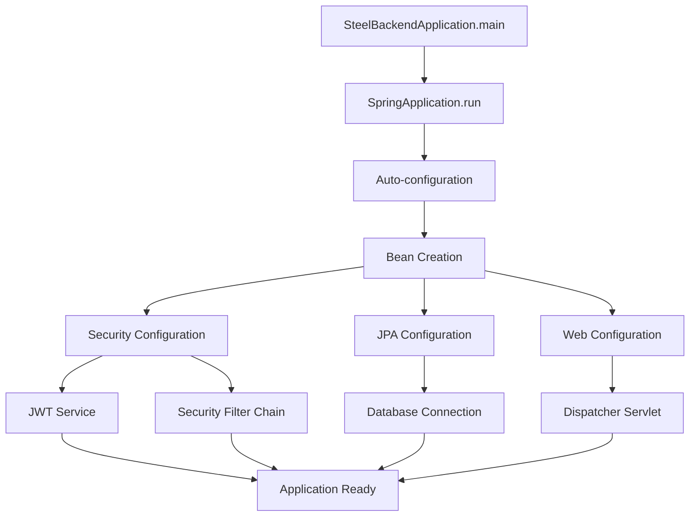
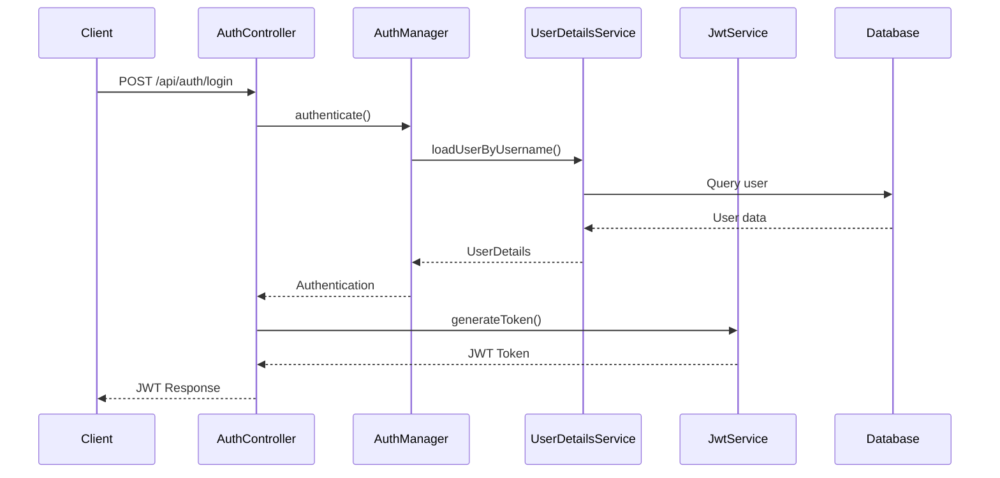
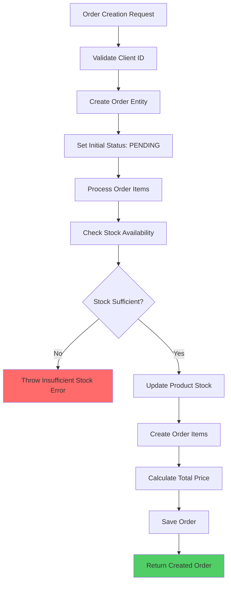
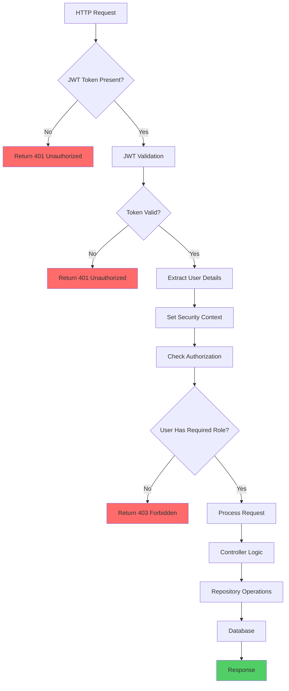
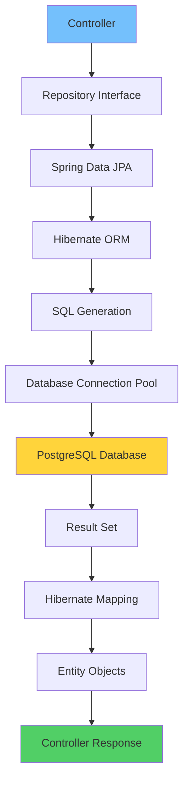

# Steel Backend - Comprehensive Project Documentation

## Table of Contents

1. [Project Overview](#project-overview)
2. [Architecture Decisions](#architecture-decisions)
3. [Technology Stack](#technology-stack)
4. [Project Structure](#project-structure)
5. [Data Flow & Components](#data-flow--components)
6. [Security Implementation](#security-implementation)
7. [API Endpoints](#api-endpoints)
8. [Database Design](#database-design)
9. [Flowcharts](#flowcharts)
10. [Development Setup](#development-setup)
11. [Best Practices & Patterns](#best-practices--patterns)

## Project Overview

**Steel Backend** is a comprehensive Spring Boot application designed for managing steel utensils import/export operations. The system handles product catalog management, client relationships, supplier management, order processing, and inventory tracking.

### Business Domain

- **Product Management**: Steel utensils catalog with categories, pricing, and stock levels
- **Client Management**: Customer relationship management and order history
- **Supplier Management**: Vendor relationships and product sourcing
- **Order Processing**: Complete order lifecycle from creation to fulfillment
- **Inventory Management**: Real-time stock tracking and low-stock alerts

## Architecture Decisions

### Why Spring Boot 3.3.2?

- **Latest LTS Version**: Ensures long-term support and security updates
- **Java 17 Support**: Modern Java features like records, pattern matching, and enhanced switch expressions
- **Native Support**: Better performance and reduced memory footprint
- **Enterprise Ready**: Proven framework used by Fortune 500 companies

### Why PostgreSQL?

- **ACID Compliance**: Critical for financial and inventory transactions
- **JSON Support**: Flexible data storage for complex product attributes
- **Scalability**: Handles large datasets efficiently
- **Open Source**: Cost-effective for enterprise applications

### Why JWT Authentication?

- **Stateless**: No server-side session storage needed
- **Scalability**: Easy to scale across multiple instances
- **Microservices Ready**: Token-based authentication for distributed systems
- **Security**: Tamper-proof tokens with expiration

### Why Repository Pattern?

- **Data Access Abstraction**: Clean separation between business logic and data access
- **Testability**: Easy to mock repositories for unit testing
- **Flexibility**: Can switch between different data sources
- **Spring Data JPA**: Automatic query generation and optimization

## Technology Stack

### Core Framework

- **Spring Boot 3.3.2**: Main application framework
- **Spring Security 6**: Authentication and authorization
- **Spring Data JPA**: Data access layer
- **Spring Validation**: Input validation and sanitization

### Database & ORM

- **PostgreSQL 15+**: Primary database
- **Hibernate 6**: Object-relational mapping
- **JPA 3**: Database abstraction layer

### Security

- **JWT (JSON Web Tokens)**: Stateless authentication
- **BCrypt**: Password hashing algorithm
- **Spring Security**: Role-based access control

### Development Tools

- **Lombok**: Reduces boilerplate code
- **Maven**: Dependency management and build tool
- **Swagger/OpenAPI**: API documentation and testing

### Java Version

- **Java 17**: Modern Java features and performance improvements

## Project Structure

```
steel-backend/
├── src/main/java/com/steel/backend/
│   ├── config/           # Configuration classes
│   ├── model/            # Entity classes (JPA models)
│   ├── repository/       # Data access layer
│   ├── security/         # Security configuration and JWT
│   ├── web/             # REST controllers and DTOs
│   └── SteelBackendApplication.java  # Main application class
├── src/main/resources/
│   └── application.yml   # Application configuration
└── pom.xml              # Maven dependencies
```

## Data Flow & Components

### 1. Application Bootstrap Flow

```
SteelBackendApplication.main()
    ↓
SpringApplication.run()
    ↓
Auto-configuration (Spring Boot)
    ↓
Bean Creation (Security, JPA, Web)
    ↓
Application Ready
```

### 2. Request Processing Flow

```
HTTP Request → DispatcherServlet → Controller → Service → Repository → Database
    ↓
Response ← Controller ← Service ← Repository ← Database
```

### 3. Authentication Flow

```
Login Request → AuthController → AuthenticationManager → UserDetailsService → Database
    ↓
JWT Token Generation → Response to Client
    ↓
Subsequent Requests → JWT Filter → Security Context → Controller
```

### 4. Order Processing Flow

```
Order Creation → OrderController → Validation → Stock Check → Order Persistence → Stock Update
    ↓
Order Status Updates → Role-based Authorization → Status Persistence
```

## Security Implementation

### Security Configuration (`SecurityConfig.java`)

- **Stateless Sessions**: No server-side session storage
- **CSRF Disabled**: Not needed for stateless JWT authentication
- **Public Endpoints**: `/api/auth/**` and Swagger documentation
- **Protected Endpoints**: All other endpoints require authentication

### JWT Implementation (`JwtService.java`)

- **Token Generation**: Username + expiration + custom claims
- **Token Validation**: Signature verification + expiration check
- **Algorithm**: HS256 (HMAC with SHA-256)
- **Secret Management**: Base64 encoded secret from configuration

### Role-Based Access Control

- **ADMIN**: Full system access (CRUD operations)
- **MANAGER**: Product and order management
- **STAFF**: Order creation and basic operations

### Password Security

- **BCrypt Hashing**: Industry-standard password hashing
- **Salt Generation**: Automatic salt generation for each password
- **Cost Factor**: Configurable hashing strength

## API Endpoints

### Authentication (`/api/auth`)

- **POST /login**: User authentication and JWT token generation

### Products (`/api/products`)

- **GET /**: List all products
- **GET /{id}**: Get product by ID
- **POST /**: Create new product (ADMIN/MANAGER)
- **PUT /{id}**: Update product (ADMIN/MANAGER)
- **DELETE /{id}**: Delete product (ADMIN only)
- **GET /low-stock**: Get low stock products
- **PUT /{id}/stock**: Update product stock

### Orders (`/api/orders`)

- **GET /**: List all orders
- **GET /{id}**: Get order by ID
- **POST /**: Create new order (ADMIN/MANAGER/STAFF)
- **PUT /{id}/status**: Update order status (ADMIN/MANAGER)

### Clients (`/api/clients`)

- **GET /**: List all clients
- **GET /{id}**: Get client by ID
- **POST /**: Create new client
- **PUT /{id}**: Update client
- **DELETE /{id}**: Delete client

### Suppliers (`/api/suppliers`)

- **GET /**: List all suppliers
- **GET /{id}**: Get supplier by ID
- **POST /**: Create new supplier
- **PUT /{id}**: Update supplier
- **DELETE /{id}**: Delete supplier

## Database Design

### Entity Relationships

```
User (1) ←→ (N) RoleType (Many-to-Many)
Product (N) ←→ (1) Supplier (Many-to-One)
Order (N) ←→ (1) Client (Many-to-One)
Order (1) ←→ (N) OrderItem (One-to-Many)
OrderItem (N) ←→ (1) Product (Many-to-One)
```

### Key Design Decisions

- **Lazy Loading**: Used for associations to improve performance
- **Cascade Operations**: Order deletion cascades to order items
- **Audit Fields**: Automatic timestamp management
- **Validation Constraints**: Database-level constraints for data integrity

## Flowcharts

### 1. Application Startup Flow



### 2. Authentication Flow



### 3. Order Creation Flow



### 4. Request Processing with Security



### 5. Data Access Layer Flow



## Development Setup

### Prerequisites

- Java 17 or higher
- Maven 3.6+
- PostgreSQL 15+
- IDE (IntelliJ IDEA, Eclipse, or VS Code)

### Database Setup

```sql
-- Create database
CREATE DATABASE steel_db;

-- Create user
CREATE USER steel_user WITH PASSWORD 'steel_pass';

-- Grant privileges
GRANT ALL PRIVILEGES ON DATABASE steel_db TO steel_user;
```

### Application Configuration

```yaml
spring:
  datasource:
    url: jdbc:postgresql://localhost:5432/steel_db
    username: steel_user
    password: steel_pass
  jpa:
    hibernate:
      ddl-auto: update
    show-sql: true

app:
  jwt:
    secret: "your-base64-encoded-secret"
    expiration-ms: 86400000 # 24 hours
```

### Running the Application

```bash
# Navigate to project directory
cd steel-backend

# Clean and compile
mvn clean compile

# Run application
mvn spring-boot:run

# Or build and run JAR
mvn clean package
java -jar target/steel-backend-0.0.1-SNAPSHOT.jar
```

## Best Practices & Patterns

### 1. Security Best Practices

- **JWT Secret Rotation**: Regular secret key updates
- **Token Expiration**: Reasonable token lifetime (24 hours)
- **Role-Based Access**: Principle of least privilege
- **Input Validation**: Server-side validation for all inputs

### 2. Database Best Practices

- **Connection Pooling**: Efficient database connections
- **Lazy Loading**: Optimize memory usage
- **Transaction Management**: Proper transaction boundaries
- **Indexing**: Strategic database indexing

### 3. API Design Best Practices

- **RESTful Design**: Standard HTTP methods and status codes
- **Consistent Naming**: Uniform endpoint naming conventions
- **Error Handling**: Comprehensive error responses
- **Documentation**: OpenAPI/Swagger documentation

### 4. Code Quality Practices

- **Lombok Usage**: Reduce boilerplate code
- **Dependency Injection**: Constructor-based injection
- **Exception Handling**: Global exception handler
- **Validation**: Bean validation annotations

### 5. Performance Considerations

- **Stateless Design**: Easy horizontal scaling
- **Connection Pooling**: Efficient resource usage
- **Lazy Loading**: Optimize memory consumption
- **Caching Strategy**: Future implementation consideration

## Future Enhancements

### Planned Features

1. **Audit Logging**: Track all system changes
2. **Caching Layer**: Redis integration for performance
3. **File Upload**: Product image management
4. **Reporting**: Business intelligence and analytics
5. **Notification System**: Email/SMS alerts
6. **API Rate Limiting**: Prevent abuse
7. **Health Monitoring**: Application metrics and monitoring

### Scalability Considerations

- **Microservices Architecture**: Break into smaller services
- **Load Balancing**: Multiple application instances
- **Database Sharding**: Horizontal database scaling
- **Message Queues**: Asynchronous processing

---

_This documentation provides a comprehensive overview of the Steel Backend project. For specific implementation details, refer to the individual source code files and their inline documentation._
